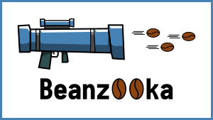
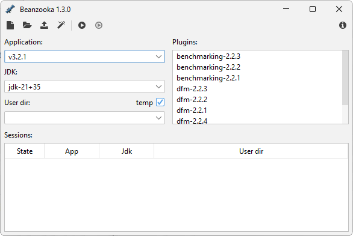

# Beanzooka - NetBeans Platform Launcher 

[](https://github.com/nbbrd/beanzooka/releases/latest)
[](https://github.com/nbbrd/beanzooka/blob/develop/CHANGELOG.md)



Beanzooka is a tool that allows to launch several sessions of a NetBeans Platform application at the same time. Each session may have its own configuration such as the user dir, the Java runtime and the active plugins.

By launching several sessions of an application, you might be able to:
- compare different versions (i.e. v1.5 vs v1.6)
- compare variations of a workspace
- check plugin behavior on different versions
- check application behavior on different JDKs
- design repeatable scenarios useful for tests, documentation and presentations

## Installing
This application requires Java 8 or later to run.  
There is no installation; you just need to download the [latest version](https://github.com/nbbrd/beanzooka/releases/latest) (`*-bin.jar`) and put it somewhere on your computer.  
Type `javaw -jar ...-bin.jar` to run it.

## How to use

In order to launch a session, you need to specify a few resources. These resources are defined through the user interface and can be stored in an XML file for future use.

The current types of resources are:

| Name          | Description                                                                     |
|---------------|---------------------------------------------------------------------------------|
| `Application` | the path to a NetBeans Platform executable                                      |
| `JDK`         | the path to a JDK home and an optional list of parameters                       |
| `User dir`    | the path to a user dir; note that this folder can be temporary, fixed or cloned |
| `Plugins`     | a list of plugins to load alongside the application                             |

To define a resource, right-click on the item you want to define and select `Edit`.

Once the resources are defined, you can launch a session by selecting an application, a JDK and a user dir (plugins are optional) and then by clicking on the launch icon (`F5`).



All sessions (both running and stopped) are displayed at the bottom of the window. Their user dir and log files can be accessed by using the context menu. Note that temporary directories are deleted when Beanzooka is closed.

## Automation

It is possible to launch Beanzooka with preloaded resources by using the command line.  
For example: `beanzooka.exe D:\some_resources.xml`

## Developing

This project is written in Java and uses [Apache Maven](https://maven.apache.org/) as a build tool.  
It requires [Java 8 as minimum version](https://whichjdk.com/) and all its dependencies are hosted on [Maven Central](https://search.maven.org/).

The code can be build using any IDE or by just type-in the following commands in a terminal:

```shell
git clone https://github.com/nbbrd/beanzooka.git
cd beanzooka
mvn clean install
```

## Contributing

Any contribution is welcome and should be done through pull requests and/or issues.

## Licensing

The code of this project is licensed under the [European Union Public Licence (EUPL)](https://joinup.ec.europa.eu/page/eupl-text-11-12).

## Credits
Logo designed by [Jeremy Demortier](https://github.com/CyLuGh)